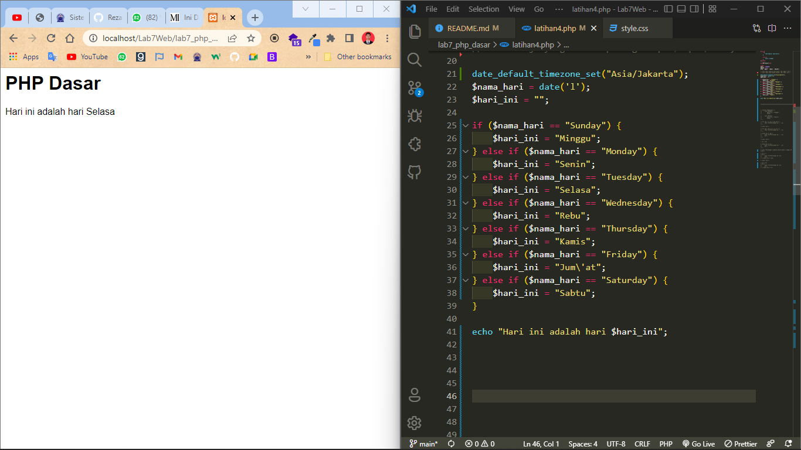

# Tugas Lab 7 Web
## Profil
| # | Biodata |
| -------- | --- |
| **Nama** | Reza Riyaldi Irawan |
| **NIM** | 312010284 |
| **Kelas** | TI.20.A.2 |
| **Mata Kuliah** | Pemrograman Web |

## Langkah 1 `Instalasi XAMPP`
1. Kunjungi [XAMPP](https://www.apachefriends.org/download.html) untuk mendownload XAMPP.
2. Sesuaikan dengan sistem operasi, versi php (saya memilih php 8), lalu klik download.
3. Lalu buka installer xampp.
4. Pada bagian ini, saya tidak ambil pusing, langsung next - next aja.


5. Maka apabila berhasil diinstall struktur foldernya seperti ini.


6. Buka Xampp Control Panel.
7. Lalu klik start pada Apache dan MySQL.


8. Buka browser kesayangan kalian, lalu ketik [http://127.0.0.1](http://127.0.0.1) atau [http://localhost](http://localhost), apabila tampil maka installasi berhasil.

## Langkah 2 `Memulai PHP`

1. Buat direktori `lab7_php_dasar` didalam direktori `Lab7Web.


2. Kemudian untuk mengakses direktori tersebut kunjungi URL berikut [http://localhost/Lab7Web/lab7_php_dasar](http://localhost/Lab7Web/lab7_php_dasar)


## Langkah 3 `PHP DASAR`

1. Buat file baru dengan nama `php_dasar.php`.
2. Tambahkan kode berikut.

```php
<!DOCTYPE html>
<html lang="en">

<head>
    <meta charset="UTF-8">
    <meta http-equiv="X-UA-Compatible" content="IE=edge">
    <meta name="viewport" content="width=device-width, initial-scale=1.0">
    <title>PHP Dasar</title>
</head>

<body>
    <h1>Belajar PHP Dasar</h1>
    <?php
        echo "Hello World";
    ?>
</body>

</html>
```

3. Kemudian akses URL seperti berikut [http://localhost/Lab7Web/lab7_php_dasar/php_dasar.php](http://localhost/Lab7Web/lab7_php_dasar/php_dasar.php)

4. Maka hasilnya akan seperti berikut.


## Langkah 4 `Variable PHP`
1. Tambahkan kode berikut.

```php
<h2>Menggunakan Variable</h2>

<?php
    $nim = "312010284";
    $nama = "Reza Riyaldi Irawan";

    echo "NIM : $nim </br>";
    echo "Nama : $nama"
?>
```

2. Maka hasilnya akan seperti berikut.


## Langkah 5 `Predefine Variable $_GET`
1. Buat file `latihan2.php` didalam direktori `lab7_php_dasar`.

2. Tambahkan kode berikut.

```php
<h1>Predefine Variable</h1>

<?php
echo "Selamat Datang " . $_GET['nama'];
```

3. Lalu ketik URL [http://localhost/Lab7Web/lab7_php_dasar/latihan2.php?nama=Reza%20Riyaldi%20Irawan](http://localhost/Lab7Web/lab7_php_dasar/latihan2.php?nama=Reza%20Riyaldi%20Irawan)

4. Maka hasilnya akan seperti berikut.


## Langkah 6 `Form Input`
1. Buat file `latihan3.php` didalam `lab7_php_dasar`.
2. Tambahkan kode berikut.

```php
<!DOCTYPE html>
<html lang="en">

<head>
    <meta charset="UTF-8">
    <meta http-equiv="X-UA-Compatible" content="IE=edge">
    <meta name="viewport" content="width=device-width, initial-scale=1.0">
    <title>PHP Dasar</title>
    <style>
        * {
            font-family: sans-serif
        }

        form {
            margin-bottom: 10px
        }
    </style>
</head>

<body>
    <h2>Form Input</h2>
    <form method="post">
        <label for="nama">Nama</label>
        <input type="text" name="nama" placeholder="Reza Riyaldi Irawan">
        <button type="submit">Kirim</button>
    </form>

    <?php
    echo "Selamat Datang " . $_POST['nama'];
    ?>
</body>

</html>
```

3. Inputkan sesuatu di dalam form, lalu kirim.
4. Maka hasilnya akan seperti berikut.


## Langkah 7 `Operator`

1. Tambahkan kode berikut.

```php
<h1>PHP Dasar</h1>

<?php
$gaji = 1000000;
$pajak = 0.1;
$thp = $gaji - ($gaji*$pajak);

echo "Gaji sebelum kena pajak = Rp. $gaji </br>";
echo "Gaji yang dibawa pulang = Rp. $thp </br>";
```

2. Maka hasilnya akan seperti berikut.


## Langkah 8 `Kondisi IF`
1. Tambahkan kode berikut.

```php
$nama_hari = date('l');
$hari_ini = "";

if ($nama_hari == "Sunday") {
    $hari_ini = "Minggu";
} else if ($nama_hari == "Monday") {
    $hari_ini = "Senin";
} else if ($nama_hari == "Monday") {
    $hari_ini = "Selasa";
} else if ($nama_hari == "Monday") {
    $hari_ini = "Rebu";
} else if ($nama_hari == "Monday") {
    $hari_ini = "Kamis";
} else if ($nama_hari == "Monday") {
    $hari_ini = "Jum\'at";
} else if ($nama_hari == "Monday") {
    $hari_ini = "Sabtu";
} 

echo "Hari ini adalah hari $hari_ini";

```

2. Maka hasilnya akan seperti berikut.



## Langkah 9 `Switch`
1. Tambahkan kode berikut.

```php
$nama_hari = date('l');
$hari_ini = "";

switch ($nama_hari) {
    case "Sunday" :
        $hari_ini = "Minggu";
        break;
    
    case "Monday" :
        $hari_ini = "Senin";
        break;

}

echo "Hari ini adalah hari $hari_ini";
```

2. Maka hasilnya akan seperti berikut.


## Langkah 10 `Looping For`
1. Tambahkan kode berikut.

```php
echo "Perulangan <code>for</code> 1 sampai 10 </br>";

for ($i = 1; $i <= 10; $i++) {
    echo "<br>Perulangan ke: " . $i;
}

echo "<br>";

for ($i = 10; $i >= 1; $i--) {
    echo "<br>Perulangan ke: " . $i;
}
```

2. Maka hasilnya akan seperti berikut.


## Langkah 11 `Looping While`
1. Tambahkan kode berikut.

```php
echo "Perulangan <code>while</code> 1 sampai 10 </br>";

$i = 1;

while ($i <= 10) {
    echo "<br>Perulangan ke: " . $i;
    $i++;
}

echo "<br>";

$i = 10;

while ($i >= 1) {
    echo "<br>Perulangan ke: " . $i;
    $i--;
}
```

2. Maka hasilnya akan seperti berikut.


## Langkah 12 `Looping Do While`
1. Tambahkan kode berikut.

```php
echo "Perulangan <code>do while</code> 1 sampai 10 </br>";

$i = 1;
do {
    echo "<br>Perulangan ke: $i";
    $i++;
} while ($i <= 10);

echo "<br>";

$i = 10;
do {
    echo "<br>Perulangan ke: $i";
    $i--;
} while ($i >= 1);

```

2. Maka hasilnya akan seperti berikut.


# Pertanyaan dan Tugas
Buatlah program PHP sederhana dengan menggunakan form input yang menampilkan
nama, tanggal lahir dan pekerjaan. Kemudian tampilkan outputnya dengan menghitung
umur berdasarkan inputan tanggal lahir. Dan pilihan pekerjaan dengan gaji yang
berbeda-beda sesuai pilihan pekerjaan.

## #1 `Persiapan`
1. Jalankan web server xampp.
2. Buat file dengan nama `index.php` didalam folder `Lab7Web`.

## #2 `Praktek`
1. Tambahkan kode berikut.

```php
<!DOCTYPE html>
<html lang="en">

<head>
    <meta charset="UTF-8">
    <meta http-equiv="X-UA-Compatible" content="IE=edge">
    <meta name="viewport" content="width=device-width, initial-scale=1.0">
    <title>Tugas</title>
    <link rel="stylesheet" href="./style.css">
</head>

<body>
    <h1>Tugas PHP Dasar</h1>

    <form action="" method="post" class="container">
        <div class="form-control">
            <label for="nama">Nama<span>*</span></label>
            <input type="text" name="nama" placeholder="Masukan nama" required>
        </div>
        <div class="form-control">
            <label for="nama">Tanggal Lahir<span>*</span></label>
            <input type="date" name="tgl_lahir" required>
        </div>
        <div class="form-control">
            <label for="nama">Pekerjaan<span>*</span></label>
            <select name="pekerjaan" required>
                <option value="">- Pilih Pekerjaan -</option>
                <option value="Mobile Application Developer">Mobile Application Developer</option>
                <option value="Data Scientist">Data Scientist</option>
                <option value="Web Developer">Web Developer</option>
                <option value="DevOps">DevOps</option>
            </select>
        </div>

        <button type="submit">Kirim</button>
    </form>

    <?php
    if ($_SERVER['REQUEST_METHOD'] == "POST" && $_POST['nama'] != '') {
        $nama = ucwords(strtolower($_POST['nama']));

        // Tanggal Lahir
        $lahir = date_format(date_create($_POST['tgl_lahir']), "d F Y");

        // Hitung Umur
        $tgl = new DateTime($_POST['tgl_lahir']);
        $today = new DateTime('today');
        $umur = $today->diff($tgl)->y;

        // Pekerjaan dan Gaji
        $pekerjaan = $_POST['pekerjaan'];
        $gaji = "";

        switch ($pekerjaan) {
            case 'Mobile Application Developer' :
                $gaji = "36 Juta";
                break;

            case 'Data Scientist':
                $gaji = "19 Juta";
                break;

            case 'Web Developer':
                $gaji = "25 Juta";
                break;

            case 'DevOps':
                $gaji = "35 Juta";
                break;

            default :
                $gaji = '0';
                break;
        }
        

    ?>
        <div class="container">
            <h3>Hasil</h3>
            <hr>
            <table>
                <tr>
                    <td>Nama</td>
                    <td>: <?= $nama ?></td>
                </tr>

                <tr>
                    <td>Tanggal Lahir</td>
                    <td>: <?= $lahir ?></td>
                </tr>

                <tr>
                    <td>Umur</td>
                    <td>: <?= $umur ?> Tahun</td>
                </tr>

                <tr>
                    <td>Pekerjaan</td>
                    <td>: <?= $pekerjaan ?></td>
                </tr>

                <tr>
                    <td>Gaji</td>
                    <td>: Rp. <?= $gaji ?></td>
                </tr>
            </table>
        </div>
    <?php
    }
    ?>

</body>

</html>
```

```css
* {
    font-family: sans-serif;
    margin: 0;
    padding: 0;
}

h1 {
    text-align: center;
    margin: 20px 0;
}

h3 {
    text-align: center;
    margin-bottom: 10px;
}

.container {
    border: 1px solid black;
    width: 30%;
    margin: auto;
    padding: 20px;
    border-radius: 5px;
    margin-bottom: 30px;
}

.form-control {
    margin-bottom: 10px;
    display: flex;
    flex-direction: column;
}

input, select {
    padding: 5px;
    margin-top: 5px;
    border: 1px solid black;
    border-radius: 3px;
}

button {
    background-color: dodgerblue;
    border: none;
    padding: 8px;
    width: 100%; 
    color: white;
    margin-top: 10px;
    border-radius: 5px;
}

table {
    width: 100%;
}

td {
    padding: 5px 0;
}

span {
    color: red;
}
```

2. Tampilan awalnya akan seperti berikut.


3. Apabila memilih pekerjaan Mobile Application Developer


4. Apabila memilih pekerjaan Web Developer

